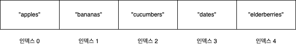

# 1장. 자료구조가 중요한 까닭

### 1.1 자료 구조

---

데이터 : 일반적으로 모든 유형의 정보를 망라함

자료 구조 : 데이터를 조직하는 방법

데이터를 조직하는 방법이 아닌 데이터 조직이 **코드의 실행 속도**에 미치는 영향에 대해 배워야한다.

### 1.2 배열: 기초 자료 구조

---

> 컴퓨터 과학에서 기초적인 자료 구조 중 하나, 인덱스와 인덱스에 대응하는 데이터들로 이루어졌다.

일반적으로 배열에는 같은 종류의 데이터들이 순차적으로 저장된다.
> 

크기 : 배열에 들어있는 데이터 요소 갯수

요소 : 배열을 구성하는 각각의 데이터를 의미

인덱스 : 배열 내에서 특정 데이터 요소의 위치를 가리키는 숫자

대부분의 프로그래밍 언어에서 인덱스는 **0**부터 시작한다.

아래 배열 그림을 살펴보면 sample이라는 배열이 있다.

이 배열의 인덱스 0번째 값 즉, sample[0] 값은 “apples” 이다.

sample 배열

### 1.2.1 자료 구조 연산

---

> 대부분의 자료 구조는 4가지 기본 방법을 사용, 이를 연산이라 부른다.
> 

- 읽기 : 자료 구조 내 특정 위치 찾기
- 검색 : 자료 구조 내 특정 값 찾기
- 삽입 : 자료 구조에 새로운 값 추가
- 삭제 : 자료 구조에서 값 제거

### 1.3 속도 측정

---

> **시간** 관점에서 연산이 빠른가가 아닌 얼마나 많은 **단계**가 필요한지를 논해야 한다.
> 

시간은 연산을 실행하는 하드웨어에 따라 바뀌기 때문이다.

### 1.4 배열-읽기

---

> 자료 구조 내 특정 위치 찾기
> 

프로그램에서 배열을 선언하면 컴퓨터는 프로그램이 쓸 수 있는 연속된 빈 셀들의 집합을 할당한다.

컴퓨터는  배열을 할당할 때 어떤 메모리 주소에서 시작하는지 기록해두기 때문에, 특정 인덱스의 값을 찾으라고 요청하면 해당 주소에 바로 접근하여 값을 찾아낸다.

→ 배열 읽기는 매우 효율적인 연산으로 한 단계로 끝난다.

### 1.5 배열-검색

---

> 자료 구조 내 특정 값 찾기
> 

컴퓨터는 모든 메모리 주소에 한 번에 접근하지만 각 메모리 주소에 어떤 값이 있는지 바로 알지 못한다.

찾아야하는 특정 값을 발견할 때까지 배열의 모든 셀을 검색해야한다.

→ N개의 셀로 이뤄지 배열은 선형 검색에 최대 N개의 단계가 필요하다.

### 1.6 배열-삽입

---

> 자료 구조에 새로운 값 추가
> 

배열 맨 뒤에 값을 삽입할 때는 한 단계만 필요하다. (언어마다 방식이 다르므로 깊숙하게 파고들지는 않겠다.)

그러나 배열의 맨 처음 혹은 중간에 데이터를 삽입할 경우, 삽입할 공간을 만들기 위해 데이터를 한 셀씩 오른쪽으로 이동시켜야 한다.

맨 처음에 데이터를 삽입할 경우 배열 내 모든 값을 한 셀씩 오른쪽으로 옮겨야한다. = 최악의 시나리오

→ 원소 N개를 포함하는 배열에서 삽입에 필요한 최대 N+1 단계가 필요하다. (이동 N + 삽입 1)

### 1.7 배열-삭제

---

> 자료 구조에서 값 제거
> 

특정 값을 삭제하는 데 실제로는 한 단계만 걸리지만, 비어있는 셀을 채우기 위해 데이터를 한 셀씩 왼쪽으로 이동시켜야 한다. 

배열 삽입과 마찬가지로, 배열의 맨 처음 요소를 삭제할 경우가 최악의 시나리오다.

→ 원소 N개를 포함하는 배열에서 삭제에 필요한 최대 N단계가 필요하다. (삭제 1 + 남은 데이터 이동 N-1)

### 1.8 집합-중복 값을 허용하지 않는 자료구조

---

> 중복 값을 허용하지 않음
> 

배열 기반의 집합은 값들의 단순 리스트로 배열과 거의 비슷하다. 

차이점은 중복 값의 삽입을 절대 허용하지 않는다.

집합의 연산

- 읽기
    - 배열의 읽기와 동일
    - 한 단계 필요
- 검색
    - 배열의 검색과 동일
    - 최대 N단계 필요
- **삽입**
    - 배열의 삽입과 다름
    - 삽입 전 검색을 통해 중복 데이터가 있는 지 판별해야함
    - 최대 2N+1단계 필요
- 삭제
    - 배열의 삭제와 동일
    - 최대 N단계 필요
