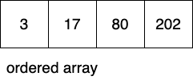
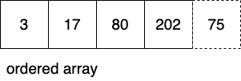
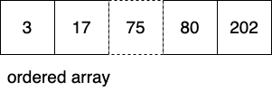
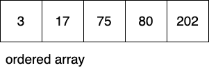

# 2장. 알고리즘이 중요한 까닭

### 2.1 정렬된 배열

---

> “전형적인 배열”과 거의 같다.

유일한 차이는 값이 항상 순서대로 있어야 한다는 점이다.
> 

ordered array로 예를 들어보겠다.



해당 배열에 **75**를 삽입해보겠다.

전형적인 배열이라면 다음처럼 끝에 76를 삽입할 것이다.



그러나 **정렬된 배열**에서는 값을 오름차순으로 유지하려면 적절한 위치에 75를 삽입해야 한다.

다시 말하면 정렬된 배열은 실제 삽입 전에 검색을 먼저 수행해야만 한다.

정렬된 배열에서의 삽입은 다음과 같은 순서로 진행된다.

1. 값이 들어갈 위치 찾기(검색)

2. 기존 값을 옮겨 빈 공간 만들기

3. 데이터 삽입



즉, 최대 N+1단계가 필요하다. 삽입에 있어서는 정렬된 배열이 전형적인 배열보다 덜 효율적이지만, 정렬된 배열의 강력함은 **검색 연산**에서 드러난다.

### 2.2 검색

---

다음 정렬된 배열이 있다.



정렬된 배열에서는 값이 배열에 들어있지 않은 때 검색을 빨리 멈출 수 있다.

22이라는 수를 검색한다고 가정해본다면, 75에 도달하면 더이상 22가 오른쪽에 있을 수 없으므로 바로 검색을 중단할 수 있다.

그러나 검색하려는 값이 배열 내 마지막 값 혹은 마지막 값 보다 크면 모든 셀을 검색해야 한다.

일반적인 배열, 정렬된 배열 모두 선형 검색 최악의 시나리오에서는 최대 단계가 필요하다.

정렬된 배열에서 값을 찾는 방법은 선형 검색 외에도 이진 검색이라는 알고리즘을 사용할 수 있는데,

이진 검색은 선형 검색보다 훨씬 빠르다.

### 2.3 이진 검색

---

> 오름차순으로 정렬된 리스트에서 특정한 값의 위치를 찾는 알고리즘

정렬된 리스트에서만 사용할 수 있다는 단점이 있으나 검색이 반복될 때마다 검색 범위가 절반씩 줄기 때문에 속도가 매우 빠르다는 장점이 있다.
> 

다음 코드는 파이썬으로 구현한 이진 검색이다.

```python
def binary_search(array, search_value):
    # 최초의 상한선은 배여르이 첫 번째 값, 하한선은 마지막 값
    lower_bound = 0
    upper_bound = len(array) - 1
    while lower_bound <= upper_bound:
        # 중간 지점 찾기 // 연산자를 이용해서 결과값이 정수로 딱 떨어지게 함
        mid_idx = (lower_bound + upper_bound) // 2

        # 찾는 값 비교, 값이 더 큰지 혹은 작은지에 따라 상한선 혹은 하한선을 바꾼다.
        if array[mid_idx] == search_value:
            return mid_idx
        elif array[mid_idx] > search_value:
            upper_bound = mid_idx - 1
        else:
            lower_bound = mid_idx + 1
    
    # 찾는 값이 없으면 None 리턴
    return None

array = [3, 17, 75, 80, 202]
search_value = 75
print(binary_search(array, search_value))
```

### 2.4 이진 검색 VS 선형 검색

---

100개의 값을 갖는 배열에서 각 검색에 필요한 최대 단계 수는 다음과 같다.

- 선형 검색 : 100단계
- 이진 검색 : 7단계

선형 검색은 찾고 잇는 값이 마지막 셀에 있거나 혹은 마지막 셀의 값보다 크면 모든 원소를 검색해야 한다.

즉, 원소가 N개 이면 최대 N단계가 필요하다.

이진 검색은 한번 검색할 때마다 검색할 셀을 절반씩 제거할 수 있다.

배열의 크기가 3개일 때 이진 검색에 필요한 최대 단계 수는 2다. 배열의 크기를 두배로 늘려 크기가 7(단순 계산을 위해 홀수로 유지)일 때, 이진 검색에 필요한 최대 단계 수는 3이 된다.

→ 정렬된 배열의 크기를 2배로 늘릴 때마다 이진 검색의 필요한 단계 수는 1씩 증가하는 패턴을 찾을 수 있다.

선형 검색과 이진 검색의 성능 차이는 다음 그래프를 통해 확인할 수 있다.

n이 선형 검색, log(n)이 이진검색

](../imgs/linear_binary.png.png)

이미지 출처 : [https://wayhome25.github.io/cs/2017/04/15/cs-16/](https://wayhome25.github.io/cs/2017/04/15/cs-16/)

정리하면 정렬된 배열이 모든 상황에서 빠른 것은 아니다. 앞서 봤듯이 정렬된 배열의 삽입은 일반 배열보다 느리다. 그러나 검색은 훨씬 빠르다.